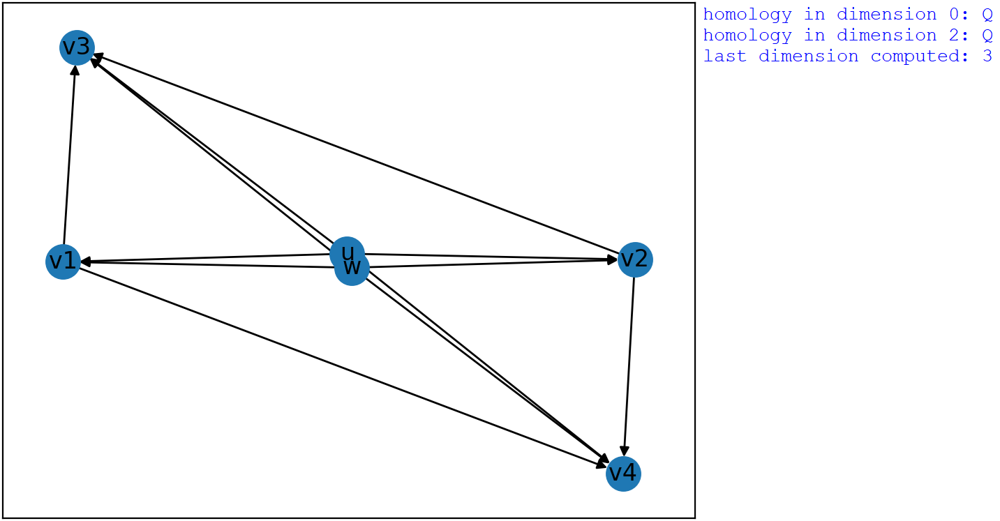
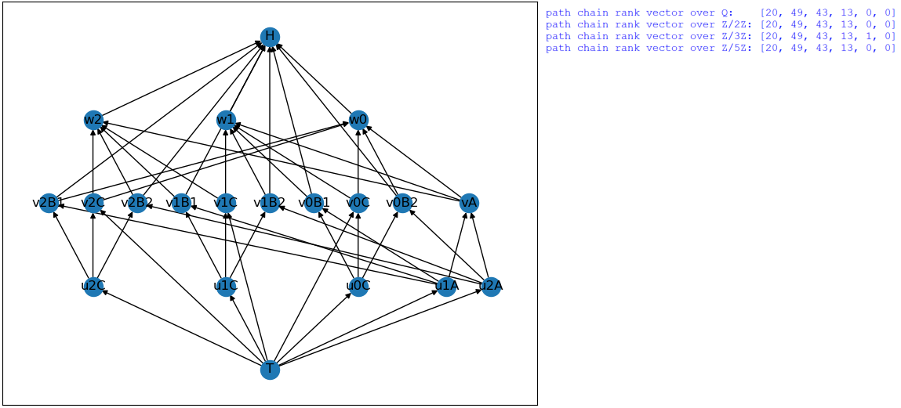

# Path-homology-with-field-coefficients

# Table of Contents

1. [Overview](#Overview)
2. [Methods](#Methods)
3. [Installation](#Installation)  
4. [Usage](#Usage)
      1. [Examples](#Examples)
      3. [Reference manual](#Reference-manual)

# Overview

Computes (though not especially efficiently) the path homology, path homology boundary matrices and bases of the path chain complex of a digraph with respect to coefficients that are rational or a finite field.

This code accompanies the paper: Matthew Burfitt and Tyrone Cutler, [Inductive construction of path homology chains](???).
The original purpose of the code was to independently check the examples Section 6 of the paper, which we include as example scrips.
The algorithm is independent of the method developed in the paper above and based on the procedure outlaid in the paper: Alexander Grigor’yan, [Advances in path homology theory of digraphs](https://intlpress.com/site/pub/files/_fulltext/journals/iccm/2022/0010/0002/ICCM-2022-0010-0002-a007.pdf) Section 1.7.

# Methods

Let $`K`$ be the field of rational numbers $`\mathbb{Q}`$ or a finite field $`\mathbb{Z}/p\mathbb{Z}`$ for some prime number $`p`$.
The path homology of a digraph $`G`$ is computed in the fllowing steps.

1. Allowed paths are vertices of $`G`$ in dimension $`0`$, edges of $`G`$ in dimension $`1`$ and obtained in dimension $`n \geq 2`$ by concatenating any allowed paths in dimensions $`n-1`$ and an edge whose source vertex is the same as the final vertex in the $`(n-1)`$-path.

2. A basis for the path chains $`C_*(G;K)`$ is obtained as the null space of the magnitude homology differential by identifying allowed paths with the basis of the diagonal magnitude chains.

3. The boundary matrix of the path homology differential  $`M(\partial_n)`$ is obtained on the computed basis of the path chains directly in terms of allowed paths and then transformed so that the image is given with respect to the path chain basis in dimension $`n-1`$.

4. The rank of the homology in dimension $`n \geq 0`$ is given by the standard formula
```math
\text{rank}\left(H_n(G;K)\right) = \text{dim}\left(C_n(G;K)\right) - \text{rank}\left(M(\partial_n)\right) - \text{rank}\left(M(\partial_{n+1})\right)
```
&nbsp;&nbsp;&nbsp;&nbsp;&nbsp;&nbsp;&nbsp;where $`\text{rank}\left(M(\partial_{0})\right) = 0`$.

# Installation

Required python packages: numpy (version 1.26.4), matplotlib (version 3.8.4), networkx (version 3.3) and sympy (version 1.12).

Place a copy of "PathHomology.py" in your python path, nothing else required other than Python 3 (version 3.10.4).

# Usage

Load the *NeighbourhoodBoundaryVolume* library.

```python
import PathHomology as ph
```

## Examples

Example computing each basis of the path chain complex of a multisquare digraph and gain after adding an additional edge across the multisquare.
In the first case a basis in dimensions $`2`$ consists of two elements obtained as the difference of two $`2`$-paths around distinct directed squares, in the second the basis consists of all $`2`$-paths.

```python
import PathHomology as ph
import matplotlib.pyplot as plt

#define digraph
G = ph.Digraph(edges =
               [('u','v1'),('u','v2'),('u','v3'),
                ('v1','w'),('v2','w'),('v3','w')])

#obtain basis of the path chain complex of the digraph G
null_spaces, paths = G.path_chain_basis(max_dim = 3, coefficients = 0)
ph.display_path_chain_basis(null_spaces, paths, dim = 2)

#display the digraph
G.plot()
plt.show()

#add an additional edge to the digraph between vertices 'u' and 'w'
G.add_edge(('u','w'))

#obtain basis of the path chain complex of the digraph G
null_spaces, paths = G.path_chain_basis(max_dim = 3, coefficients = 0)
ph.display_path_chain_basis(null_spaces, paths, dim = 2)

#display the new digraph
G.plot()
plt.show()
```

<p align="center" name="multisquare">
      
</p>

Example computing the path homology of a digraph $`G`$ whose edges lie on the one-skeleton of a octahedron.
In particulare, we see that the path homology groups of $`G`$ are
```math
H_n(G;\mathbb{Q}) =
\begin{cases} 
        \mathbb{Q}
        &
        \text{if} \; n=0 \: \text{or} \: n=2
        \\
        0
        &
        \text{otherwise}
\end{cases}
```
for each $`n \in \mathbb{N}`$.

```python
#define digraph
G = ph.Digraph(edges =
               [('u','v1'),('u','v2'),('u','v3'),('u','v4'),
                ('v1','v3'),('v1','v4'),('v2','v3'),('v2','v4'),
                ('w','v1'),('w','v2'),('w','v3'),('w','v4')])

#obtain path homology of the digraph
homology, _, _, _ = G.path_homology(max_dim = 3, coefficients = 0)
ph.display_homology(homology)

#display the digraph
G.plot()
plt.show()
```

<p align="center" name="octahedron" width="50%" height="50%">
      
</p>

This exmaple come form the paper: Xin Fu and Sergei Ivanov, [Path homology of digraphs without multisquares and its comparison
with homology of spaces](https://arxiv.org/pdf/2407.17001) Section 5.4.
The digraph $`G`$ has path chain rank $`1`$ in dimension $`4`$ with coefficients $`Z/2Z`$ and path chain rank $`0`$ in dimension $`4`$ with coefficients $`Q`$ or $`Z/pZ`$ for $`p`$ a prime larger than $`2`$.
In particular, as the path chain ranks in other dimensions remain the same with all the coefficients above, the Euler characteristic changes depending on the coefficients.

```python
#define digraph
G = ph.Digraph(edges =
               [('x0','x10'),('x0','x11'),('x0','x12'),
                 ('x10','x20'),('x11','x21'),('x12','x22'),('x10','x21'),('x11','x22'),('x12','x20'),
                 ('x20','x30'),('x21','x31'),('x22','x32'),('x20','x31'),('x21','x32'),('x22','x30'),
                 ('x30','x4'),('x31','x4'),('x32','x4'),
                 ('x10','x30'),('x11','x31'),('x12','x32'),('x10','x32'),('x11','x30'),('x12','x31')])

#show chain rank vector with different coefficients
print('path chain rank vector over Q:   ', G.chain_rank_vector(max_dim = 5, coefficients = 0))
print('path chain rank vector over Z/2Z:', G.chain_rank_vector(max_dim = 5, coefficients = 2))
print('path chain rank vector over Z/3Z:', G.chain_rank_vector(max_dim = 5, coefficients = 3))

#display the digraph
positions = {
            'x0':(0,0),
            'x10':(-1,1),'x11':(0,1),'x12':(1,1),
            'x20':(-1,2),'x21':(0,2),'x22':(1,2),
            'x30':(0,3),'x31':(1,3),'x32':(2,3),
            'x4':(1,4)
            }
G.plot(positions = positions)
plt.show()
```

<p align="center" name="Euler2">
      
</p>

The next example corresponds to Example 6.1 form the a accompanying paper.
With rational coefficients, the path boundary matrix of the digraph $`G`$ between dimension $`4`$ and dimension $`3`$ has entries of an arbitrary multiplicity $`t`$.
Try changing the value of $`t`$ and or the coefficients!

```python
#generate digraph edges and a set of vertex positions
def M_t(t = 2):
    edges = [('T','u1A'),('T','u2A'),('T','uB'),
             ('u1A','v1A'),('u1A','v2A'),('u2A','v1A'),('u2A','v2A'),
             ('v1A','wA'),('v2A','wA'),
             ('wA','H')]
    vertex_positions = {'T':(0,0),
                        'u1A':(1,1),'u2A':(2,1),'uB':(-t,1),
                        'v1A':(1,2),'v2A':(2,2),
                        'wA':(1.5,3),
                        'H':(0,4)}
    for i in range(0,2*t):
        edges.append(('uB','v'+str(i)+'B'))
        edges.append(('v'+str(i)+'B','w'+str(i)+'B'))
        edges.append(('v'+str(i)+'B','w'+str(((i+1)%(2*t)))+'B'))
        edges.append(('w'+str(i)+'B','H'))
        vertex_positions['v'+str(i)+'B'] = (-i,2)
        vertex_positions['w'+str(i)+'B'] = (-i,3)
    for i in range(0,t):
        edges.append(('u1A','v'+str(((2*i)%(2*t))+1)+'B'))
        edges.append(('u2A','v'+str(((2*i)%(2*t)))+'B'))
        edges.append(('v1A','w'+str(((2*i)%(2*t)))+'B'))
        edges.append(('v2A','w'+str(((2*i)%(2*t))+1)+'B'))
    return edges, vertex_positions

#define digraph
edge, positions = M_t(t = 2)
G = ph.Digraph(edges = edge)

#obtain path homology and path boundary matrices of the digraph
print('\n')
homology, bnd_matrices, null_spaces, paths = G.path_homology(max_dim = 5, coefficients = 0)
ph.display_homology(homology)
print('\n')
print('boundary matrix from dimension 4 to 3:')
print(bnd_matrices[3])

#display the digraph
G.plot(positions = positions)
plt.show()
```

<p align="center" name="multiplicity">
      
</p>

The final example corresponds to Example 6.2 form the accompanying paper.
The digraph $`G`$ has path chain rank $`1`$ in dimension $`4`$ with coefficients $`Z/tZ`$ (t is set to 3 below) and path chain rank $`0`$ in dimension $`4`$ with coefficients $`Q`$ or $`Z/pZ`$ for $`p`$ a prime larger than $`2`$ and not equal to $`t`$.
In particular, as the path chain ranks in other dimensions remain the same with all the coefficients above, the Euler characteristic changes depending on the coefficients.
Try changing the value of $`t`$ and or the coefficients!

```python
#generate digraph edges and a set of vertex positions
def E_t(t = 3):
    edges = [('T','u1A'),('T','u2A'),
             ('u1A','vA'),('u2A','vA'),]
    vertex_positions = {'T':(-t,0),
                        'u1A':(1,1),'u2A':(2,1),
                        'vA':(1.5,2),
                        'H':(-t,4)}
    for i in range(0,t):
        edges.append(('T','u'+str(i)+'C'))
        edges.append(('T','v'+str(i)+'C'))
        #
        edges.append(('u1A','v'+str(i)+'B1'))
        edges.append(('u2A','v'+str(i)+'B2'))
        edges.append(('u'+str(i)+'C','v'+str(i)+'B1'))
        edges.append(('u'+str(i)+'C','v'+str(i)+'B2'))
        edges.append(('u'+str(i)+'C','v'+str(i)+'C'))
        #
        edges.append(('v'+str(i)+'B1','w'+str((i+1)%t)))
        edges.append(('v'+str(i)+'B2','w'+str(i)))
        edges.append(('v'+str(i)+'C','w'+str(i)))
        edges.append(('v'+str(i)+'C','w'+str((i+1)%t)))
        edges.append(('vA','w'+str(i)))
        #
        edges.append(('v'+str(i)+'B1','H'))
        edges.append(('v'+str(i)+'B2','H'))
        edges.append(('w'+str(i),'H'))
        #
        vertex_positions['u'+str(i)+'C'] = ((-3*i-1),1)
        vertex_positions['v'+str(i)+'C'] = ((-3*i-1),2)
        vertex_positions['v'+str(i)+'B1'] = ((-3*i-2),2)
        vertex_positions['v'+str(i)+'B2'] = ((-3*i),2)
        vertex_positions['w'+str(i)] = ((-3*i-1),3)
    return edges, vertex_positions

#define digraph
edge, positions = E_t(t = 3)
G = ph.Digraph(edges = edge)

#show chain rank vector with different coefficients
print('path chain rank vector over Q:   ', G.chain_rank_vector(max_dim = 5, coefficients = 0))
print('path chain rank vector over Z/2Z:', G.chain_rank_vector(max_dim = 5, coefficients = 2))
print('path chain rank vector over Z/3Z:', G.chain_rank_vector(max_dim = 5, coefficients = 3))
print('path chain rank vector over Z/5Z:', G.chain_rank_vector(max_dim = 5, coefficients = 5))

#display the digraph
G.plot(positions = positions)
plt.show()
```

<p align="center" name="Eulerp">
      
</p>


## Reference-manual

### Display functions

#### &#x1F539; PathHomology.display_path_chain_basis(null_spaces, paths, dim = 0)

Given the allowed paths in a digraph and a basis of the path homology chains indexing allowed paths, displays in an easily readable format the basis in terms of the allowed paths explicitly in any given dimension.

|  | Variable | Description |
| ------------ | ------------- | ------------- |
| **Parameters:** | **null_spaces** | List of two dimensional numpy arrays, where each array represents a matrix in which each row is the multiplicity of the corresponding allowed path in the accomnaying 'paths' list. |
| | **paths** | List of two dimensional numpy arrays, where each array represents a matrix in which each row is the multiplicity of the corresponding allowed path in the accompanying ‘paths’ list. |
| | **dim** | Integer greater than or equal to zero which is at least one less than the total number of null spaces and paths. |

#### &#x1F539; PathHomology.display_homology(homology)

Given a homology directory, returned by the 'path_homology' function of the 'PathHomology.Digraph' class, displays in an easily readable format the homology groups in each dimension in their associated coefficients.

|  | Variable | Description |
| ------------ | ------------- | ------------- |
| **Parameters:** | **homology** | A directory, containing information about the homology groups of a digraph returned by the 'path_homology' function of the 'PathHomology.Digraph' class. |


### Digraph class

#### &#x1F539; Class PathHomology.Digraph(vertices = [], edges = [])

A python class representing a digraph. Note, any necessary vertices are contained in an edge and not in the 'vertices' variable are added automatically.

|  | Variable | Description |
| ------------ | ------------- | ------------- |
| **Parameters:** | **vertices** | List of strings, where each string corresponds to a vertex of the digraph. If left empty, as is the case by default, then vertices will simply be added when required in an edge. |
| | **edges** | List of pairs of strings. Each pair represents an edge in the digraph, each string in the pair corresponds to a vertex of the digraph, the first string being the source vertex and the second string being the target vertex. |

The PathHomology.Digraph class has the following proprieties:

#### &#x1F539; vertex_number

**Returns:** the number of vertices in the digraph 

#### &#x1F539; edge_number

**Returns:** the number of edges in the digraph 

The PathHomology.Digraph class contains the following functions:

#### &#x1F539; add_vertex(vertex = [])

Adds additional vertex or vertices to the digraph.

|  | Variable | Description |
| ------------ | ------------- | ------------- |
| **Parameters:** | **vertices** | List of strings, where each string corresponds to a vertex of the digraph or a string corresponds to a single vertex of the digraph to be added. |

#### &#x1F539; remove_vertex(vertex = [])

Remove vertex or vertices and all associated edges from the digraph.

|  | Variable | Description |
| ------------ | ------------- | ------------- |
| **Parameters:** | **vertices** | List of strings, where each string corresponds to a vertex of the digraph or a string corresponds to a single vertex of the digraph to be removed. |

#### &#x1F539; add_edge(edge)

Adds a single edge to the digraph. Any necessary vertices are also added automatically.

|  | Variable | Description |
| ------------ | ------------- | ------------- |
| **Parameters:** | **edges** | Pairs of strings, where each string in the pair corresponds to a vertex of the digraph, the first string being the source vertex and the second string being the target vertex. |

#### &#x1F539; add_multiple_edges(edges = [])

Adds multiple edges to the digraph. Any necessary vertices are also added automatically.

|  | Variable | Description |
| ------------ | ------------- | ------------- |
| **Parameters:** | **edges** | List of pairs of strings. Each pair represents an edge in the digraph, each string in the pair corresponds to a vertex of the digraph, the first string being the source vertex and the second string being the target vertex. |

#### &#x1F539; remove_edge(edge)

Removes a single edge to the digraph.

|  | Variable | Description |
| ------------ | ------------- | ------------- |
| **Parameters:** | **edges** | Pairs of strings, where each string in the pair corresponds to a vertex of the digraph, the first string being the source vertex and the second string being the target vertex. |

#### &#x1F539; remove_multiple_edges(edges = [])

Removes multiple edges to the digraph. Any necessary vertices are also added automatically.

|  | Variable | Description |
| ------------ | ------------- | ------------- |
| **Parameters:** | **edges** | List of pairs of strings. Each pair represents an edge in the digraph, each string in the pair corresponds to a vertex of the digraph, the first string being the source vertex and the second string being the target vertex. |

#### &#x1F539; plot(positions = None)

Plots an image of the digraph.

|  | Variable | Description |
| ------------ | ------------- | ------------- |
| **Parameters:** | **positions** | A directory with a key corresponding to each vertex in the digraph each containing a pair of integers the determine the position of where the vertex is plotted in the plane. If no potions are specified the positions will be chosen automatically. |

#### &#x1F539; get_allowed_paths(max_dim = 3)

Obtains from the digraph all the allowed paths up to a specified length.

|  | Variable | Description |
| ------------ | ------------- | ------------- |
| **Parameters:** | **max_dim** | Integer indicating the maxima length of allowed paths to compute. |
| **Returns:** | | A list of lists of strings, where each string is a vertex of the digraph and each list of vertices is an allowed path in the digraph. |

#### &#x1F539; magnitude_differentials(max_dim = 3)

Obtains from the digraph all matrices of magnitude differentials up to a specified dimension, along with the corresponding allowed paths and images under magnitude differentials corresponding to the rows and columns of the differential matrices.

|  | Variable | Description |
| ------------ | ------------- | ------------- |
| **Parameters:** | **max_dim** | Integer indicating the maximum dimension of magnitude boundary matrix to be computed. |
| **Returns:** | **differential_matrices** | A list of 2-dimensional integer numpy arrays representing the boundary matrices on the diagonal magnitude homology magnitude with respect to the allowed paths (rows) and path images (colums) in given in the subsequent two output variables. |
| | **allowed_paths** | A list of lists of strings, where each string is a vertex of the digraph and each list of vertices is an allowed path in the digraph.  |
| | **path_images** | A list of lists of strings, where each string is a vertex of the digraph and each list of vertices is an element of a module in a second diagonal magnitude homology chain complex (the image of the magnitude differential on the diagonal magnitude chains). |

#### &#x1F539; path_chain_basis(max_dim = 3, coefficients = 0)


#### &#x1F539; chain_rank_vector(max_dim = 3, coefficients = 0)


#### &#x1F539; path_differentials(max_dim = 3, coefficients = 0)


#### &#x1F539; path_homology(max_dim = 3, coefficients = 0, as_vector = False)


